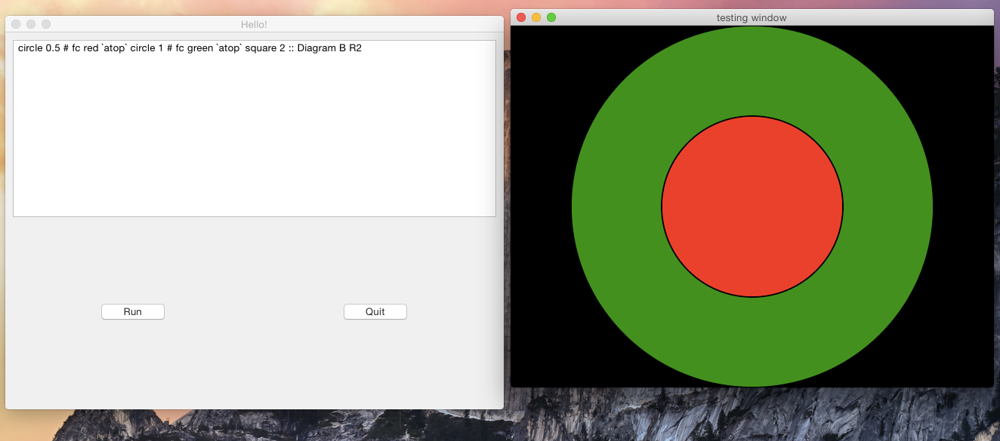

# diagramming
This project aims to be something similar to processing.org except using haskell.
Something anyone can download and run to very quickly start making graphical code for fun and profit without needing to wrestle with cabal and ghc installation.

## Screenshot


## Building
```bash
  # Install wxWidgets: 
  # - https://wiki.haskell.org/WxHaskell/Linux
  # - https://wiki.haskell.org/WxHaskell/Mac
  # - https://wiki.haskell.org/WxHaskell/Windows

  # Then do the usual cabal dance
  cabal sandbox init
  cabal configure
  cabal build
  cabal install
  
  # Run:
  cabal exec diagramming    #exec runs the app in the sandbox context
```


## Packaging as a standalone app
AA TODO: Currently broken.  Doesnt properly package up the diagrams packages from the sandbox for hint to eval with
```bash
  # On OSX: To package it up as an OSX app bundle:
  runghc Setup configure
  sudo runghc Setup build   # Needs sudo to scan for dynamic system libs to package up
  # Then run it with:
  open dist/build/diagramming.app
```
